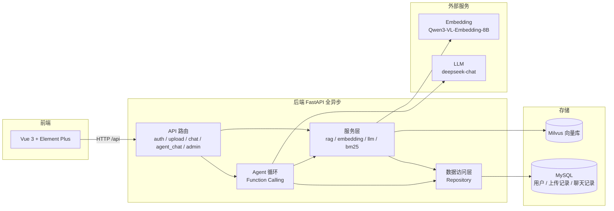

# 企业智能知识库 Agent 平台

基于 RAG + Function Calling Agent 的企业内部知识库智能问答系统。
上传 PDF/TXT 制度文档后，可以用「RAG 模式」做文档检索问答，或用「Agent 模式」
让 LLM 自主决策调用工具——既能检索文档，也能查询结构化数据（SQL），
适合银行/企业制度文档检索 + 统计查询场景。


## 一、功能特性

- 文档上传与去重：上传 PDF/TXT，MD5 判重（重复文件 409 拒绝），自动切片 + 向量化入库
- 混合检索 RAG：向量检索（Milvus）+ BM25 关键词检索，RRF 融合 + 文档去重 + 年份软排序
- RAG 问答：混合检索 + LLM 生成，返回答案并附带引用来源与相关度
- Agent 问答：Function Calling 自主决策，动态调用两个工具
    `knowledge_search` —— 检索知识库文档
    `sql_query` —— 查询结构化数据（仅允许 SELECT，白名单表）
- 用户认证与权限：JWT 登录认证，admin/user 两角色；上传/重置限 admin，问答需登录
- Vue 前端：Element Plus，登录界面 + 侧边栏（上传/状态/重置）+ 双模式对话界面
- 全异步后端：async SQLAlchemy + async OpenAI，高并发不阻塞事件循环


## 二、技术栈

| 层 | 技术 |
|----|------|
| 后端 | FastAPI（全异步）+ uvicorn |
| 数据访问 | SQLAlchemy 2.0 异步 ORM（asyncmy 驱动）+ Alembic 迁移 |
| 配置 / 依赖注入 | Pydantic Settings + FastAPI Depends |
| 认证 | JWT（pyjwt，HS256）+ pbkdf2 密码哈希 |
| 文档处理 | PyPDF2（文本提取）+ 按句切片（overlap） |
| Embedding | Qwen/Qwen3-VL-Embedding-8B（硅基流动 SiliconFlow，4096 维） |
| 向量库 | Milvus（开发用 Milvus Lite 本地文件，生产用 standalone） |
| LLM | deepseek-chat（DeepSeek API，OpenAI SDK 兼容） |
| Agent | 手写 Function Calling 循环（不依赖 LangChain） |
| 数据库 | MySQL 8.x |
| 前端 | Vue 3 + Vite + TypeScript + Element Plus + Pinia + Vue Router |


## 三、项目结构

```
agent/
├── backend/               FastAPI 后端（全异步）
│   ├── main.py            入口：app 工厂 + CORS + lifespan（建表/预置admin/确保Milvus）
│   ├── core/              config.py(Pydantic Settings) / security.py(JWT) / deps.py(依赖注入)
│   ├── db/                base.py(声明基类) + session.py(async 引擎)
│   ├── models/            SQLAlchemy ORM：User / UploadedFile / ChatHistory
│   ├── schemas/           Pydantic 请求/响应模型
│   ├── repositories/      数据访问层：UserRepository / FileRepository / ChatRepository
│   ├── services/          document(切片) / embedding / llm / bm25 / vector_store(Milvus) / rag
│   ├── agent/             tools.py(工具 schema) + executor.py(Agent 循环)
│   ├── tools/             search_document.py / query_database.py
│   ├── api/               auth / upload / chat / agent_chat / admin
│   └── alembic/           数据库迁移脚本
├── web/                   Vue 3 前端
│   ├── src/api/           axios 封装（http.ts + index.ts）
│   ├── src/stores/        Pinia（auth）
│   ├── src/router/        登录守卫
│   ├── src/views/         LoginView / ChatView
│   └── src/components/    SideBar / MessageItem
├── eval/                  评测集 + 脚本（download_docs / build_index / evaluate_retrieval）
├── test_backend.py        接口冒烟测试
└── docker-compose.yml     Docker 部署（backend + mysql + milvus + nginx）
```


## 四、快速开始

### 4.1 环境要求

Python 3.10+，MySQL 8.x，Node 18+，支持 Windows / Linux / macOS

### 4.2 安装依赖

```bash
pip install -r backend/requirements.txt      # 后端
cd web && npm install                        # 前端
```

### 4.3 配置 .env

复制 `backend/.env.example` 为 `backend/.env`，填入你自己的 Key 和密码：

```
LLM_MODEL=deepseek-chat
LLM_API_KEY=sk-xxx
LLM_BASE_URL=https://api.deepseek.com/v1

EMBEDDING_MODEL=Qwen/Qwen3-VL-Embedding-8B
EMBEDDING_API_KEY=sk-xxx
EMBEDDING_BASE_URL=https://api.siliconflow.cn/v1

MYSQL_HOST=127.0.0.1
MYSQL_PORT=3306
MYSQL_USER=root
MYSQL_PASSWORD=你的mysql密码
MYSQL_DATABASE=rag_agent

# 生产务必改成至少 32 字符的随机串
JWT_SECRET=请改成至少32字符的随机串

# Milvus Lite 本地文件；生产 standalone 用 http://localhost:19530
MILVUS_DB_URI=./milvus.db
```

> 注意：`MILVUS_DB_URI` 不能写成 `MILVUS_URI`——后者是 pymilvus 保留的环境变量名，会被它当成服务端地址解析而报错。

### 4.4 初始化 MySQL

```bash
mysql -u root -p -e "CREATE DATABASE IF NOT EXISTS rag_agent DEFAULT CHARACTER SET utf8mb4;"
```

后端启动时自动建表（`Base.metadata.create_all`）。版本化迁移用：

```bash
alembic -c alembic.ini upgrade head        # 在 agent/ 根目录执行
```

### 4.5 启动后端

必须在 agent/ 根目录启动（否则 `from backend.xxx` 导入会报错）：

```bash
uvicorn backend.main:app --host 0.0.0.0 --port 8000
```

启动后访问 http://localhost:8000/docs 查看 Swagger 文档。

### 4.6 启动前端

另开终端：

```bash
cd web && npm run dev
```

浏览器打开 http://localhost:5173，登录后即可提问。
前端通过 Vite 代理把 `/api/*` 转发到后端 8000（生产由 nginx 反代）。

### 4.7 Docker 一键启动

```bash
docker compose up --build
```

自动拉起 MySQL、Milvus standalone、backend、nginx 四个服务，backend 等 MySQL 就绪后
自动建表并预置 admin 账号（默认 admin / admin123）。


## 五、API 接口

| 方法 | 路径 | 说明 |
|------|------|------|
| GET | / | 根路由，返回欢迎信息 |
| GET | /status | 查询知识库索引状态 |
| POST | /auth/login | 登录，返回 JWT token（无需认证） |
| POST | /auth/register | 注册新用户（默认 user 角色，无需认证） |
| POST | /upload | 上传文档（PDF/TXT，MD5 判重，需 admin） |
| POST | /chat | RAG 问答（返回 answer + sources，需登录） |
| POST | /chat/agent | Agent 问答（返回 answer + tool_calls + iterations，需登录） |
| POST | /admin/reset | 重置知识库（all / 2h / 12h / 24h，需 admin） |


## 六、使用示例

登录（默认账号 admin / admin123，拿 token）：

```bash
curl -X POST http://127.0.0.1:8000/auth/login -H "Content-Type: application/json" -d '{"username": "admin", "password": "admin123"}'
```

上传文档（需 admin，请求头带 token）：

```bash
curl -F "file=@./data/中华人民共和国2024年国民经济和社会发展统计公报.pdf" -H "Authorization: Bearer <token>" http://127.0.0.1:8000/upload
```

RAG 问答（需登录）：

```bash
curl -X POST http://127.0.0.1:8000/chat -H "Content-Type: application/json" -H "Authorization: Bearer <token>" -d '{"query": "2024年GDP是多少？"}'
```

Agent 问答（需登录，自主决定查文档还是查库）：

```bash
curl -X POST http://127.0.0.1:8000/chat/agent -H "Content-Type: application/json" -H "Authorization: Bearer <token>" -d '{"query": "最近上传了几个文件？"}'
```


## 七、测试与评测

### 7.1 冒烟测试

```bash
# 终端 1：启动后端
uvicorn backend.main:app --host 127.0.0.1 --port 8000
# 终端 2：跑 5 项冒烟测试
python test_backend.py
```

### 7.2 检索质量评测

```bash
python eval/download_docs.py        # 下载 34 份 gov.cn 文档
python eval/build_index.py          # 建索引到 Milvus
python eval/evaluate_retrieval.py   # 跑 30 题评测，算 Recall@k
```

当前评测结果：**Recall@8 = 100%（30/30），Recall@5 = 100%，年份 Top-1 命中率 100%**。


## 八、架构图




## 九、版本规划

| 版本 | 内容 | 状态 |
|------|------|------|
| V0.1 | 命令行 RAG 最小闭环（切片 → Embedding → FAISS → LLM） | ✅ 已完成 |
| V0.2 | FastAPI 后端（upload / chat / admin / status / MD5 判重） | ✅ 已完成 |
| V0.3 | Agent（Function Calling，knowledge_search + sql_query） | ✅ 已完成 |
| V0.4 | 工程化（Streamlit 前端、引用来源、MySQL、Docker、权限） | ✅ 已完成 |
| V2.0 | 主流架构重构（全异步 + SQLAlchemy/JWT/Milvus + Vue 前端） | ✅ 已完成 |
