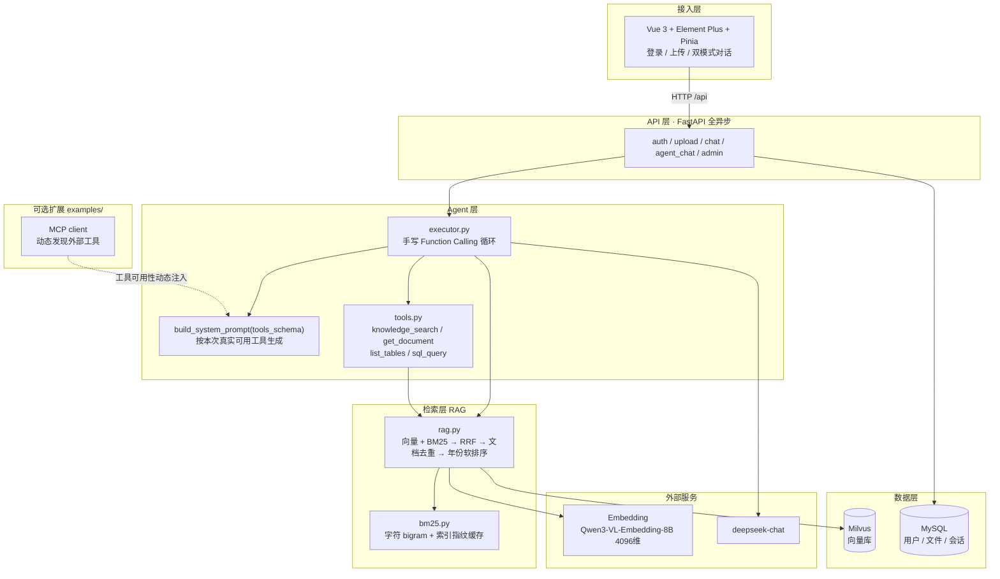

# 企业智能知识库 Agent 平台

基于 **RAG 混合检索 + 手写 Function Calling Agent** 的企业知识库问答系统，把「制度文档检索」和「结构化数据查询」放进同一个对话框。

上传 PDF/TXT 制度文档后，有两种用法：

- **RAG 模式**：固定走一次混合检索，答案带 `[id]` 引用来源。
- **Agent 模式**：LLM 自己决定查文档还是查数据库、调几次工具，前端实时展示工具调用轨迹。

面向银行/企业场景里最常见的两类问题——「某项制度是怎么规定的」和「现在有多少条记录」。

核心是两件事：**混合检索的质量**（向量 + BM25 → RRF → 年份策略）和 **Agent 循环的自主性**（不依赖 LangChain/LangGraph，自己写完整循环）。其余能力（MCP / 多智能体 / LangGraph 对照实现）都在 `examples/`，是可插拔的扩展，不启动不影响主线。


## 阅读导航

- **想把系统跑起来**：先看 [Quick Start](#quick-start)，接口细节见 [API 接口](#api-接口)，报错了查 [常见问题排查](#常见问题排查)。
- **想看它能干什么**：[主要功能](#主要功能) 与 [兼容状态](#兼容状态)。
- **想看技术深度**：[系统架构](#系统架构) → [核心技术](#核心技术) → [核心设计](#核心设计) → [Evaluation](#evaluation)。
- **想看工程细节**：[Engineering Notes](#engineering-notes) 记了实际踩过并修掉的坑，[项目结构](#项目结构) 是目录树。
- **想接着往下做**：[Future Work](#future-work) 按优先级列了明确知道该做但还没做的。
- **最厚的一份文档**：[docs/技术文档与面试准备.md](./docs/技术文档与面试准备.md)（3 万字，逐模块设计 + 面试问答）。


## 演示

两种交互模式，同一个输入框。

**RAG 模式** —— 固定走一次混合检索，答案带 `[id]` 引用：

```
用户：2024年国内生产总值是多少？
助手：2024年国内生产总值1349084亿元，比上年增长5.0%。[1]
      来源：[1] 中华人民共和国2024年国民经济和社会发展统计公报
```

**Agent 模式** —— LLM 自主决定调用哪些工具、调几次，前端实时展示工具调用轨迹：

```
用户：最近上传了几个文件？

  → list_tables   → uploaded_files(id, filename, md5, size, status, created_at)
  → sql_query     → SELECT COUNT(*) FROM uploaded_files WHERE status='done'
  → 完成（2 轮迭代）

助手：当前知识库中共有 2 个文件处于已入库状态。
```


## 主要功能

- **混合检索**：Milvus 向量 + BM25（字符 bigram）→ RRF 融合 → 文档级去重 → 年份软排序；指定 `source` 精查某一份文档时跳过去重、并把候选池放大到全量。
- **RAG 问答**：检索 + LLM 生成，返回答案并附引用来源与相关度。
- **Agent 问答**：手写 Function Calling 循环，自主决定工具与轮数；SSE 流式吐出状态、工具调用与答案。
- **工具集**：`knowledge_search`（混合检索，可指定文档与 `top_k`）、`get_document`（长文档分页读）、`list_tables`、`sql_query`（仅 SELECT）。
- **工具降级**：工具集不可用时（MCP 掉线/未装）自动收缩，system prompt 随之改写，绝不诱导模型调用一个不存在的工具。
- **上下文预算**：工具结果按工具分档截断（检索 6000 字 / 文档 10000 字），长文档用 `offset` 分页续读，引文编号整轮唯一。
- **文档管理**：PDF/TXT 上传，MD5 判重（内容重复返回 409），切片 + 向量化入库。
- **认证权限**：JWT（HS256）+ pbkdf2；admin/user 两角色，上传与重置限 admin。
- **会话持久化**：Agent 多轮记忆落库，历史消息按窗口注入。
- **全异步**：async SQLAlchemy + async OpenAI，IO 全程不阻塞事件循环。
- **评测体系**：104 题检索消融 + 39 题 Agent 评测，指标全部由脚本跑出并落盘 JSON（见 [Evaluation](#evaluation)）。


## 兼容状态

| 项目 | 当前状态 | 说明 |
|---|---|---|
| 运行平台 | Windows 为主要验证平台 | Linux / macOS 的代码路径未逐项验证；Windows 控制台下需 `PYTHONIOENCODING=utf-8`，否则打印 `✓`/`✗` 会 `UnicodeEncodeError` |
| 向量库 | 开发用 Milvus Lite（本地文件 `./milvus.db`） | **单进程独占**：后端运行时评测脚本打不开同一个库；生产切 standalone，`docker-compose` 里已备好 |
| 关系库 | MySQL 8.x，必需 | 非可选；启动时自动建表 |
| 外部模型服务 | 需自备 DeepSeek + 硅基流动 API Key | 没有 Key 时 RAG / Agent 主线不可用（见 [隐私与安全](#隐私与安全)） |
| MCP 工具 | 可选 | 未装 `mcp` 包、或 server 连不上时自动降级，不影响主线问答 |
| 多智能体 / LangGraph | `examples/` 下的对照实现 | 非主线，不随主线一并演进 |
| 输出脱敏 | 仅提示词层约束 | 代码级强制脱敏尚未实现 |
| 前端来源面板编号 | 已知偏差 | 面板按数组下标显示 `【i+1】`，多次检索时可能与答案里的 `[n]` 错位（后端已把 `id` 放进 `sources` 事件） |


## 系统架构



**一次 Agent 请求的数据流**：

```
用户问题
  → get_all_tools()              取本次真实可用的工具（可能因 MCP 掉线而收缩）
  → build_system_prompt(tools)   按可用工具生成工具清单与强制规则
  → LLM 决策 ──┬─ 返回 tool_calls → 执行工具 → 结果回灌 messages → 回到 LLM 决策
               └─ 返回 content    → 结束，落库，SSE 推给前端
  （最多 6 轮，超限强制收敛）
```


## Quick Start

### 环境要求

Python 3.10+，MySQL 8.x，Node 18+。支持 Windows / Linux / macOS。

### 1. 安装依赖

```bash
pip install -r backend/requirements.txt      # 后端（含可选的 mcp / langgraph）
cd web && npm install                        # 前端
```

### 2. 配置 .env

复制 `backend/.env.example` 为 `backend/.env`，填入自己的 Key 与密码：

```ini
LLM_MODEL=deepseek-chat
LLM_API_KEY=sk-xxx
LLM_BASE_URL=https://api.deepseek.com/v1

EMBEDDING_MODEL=Qwen/Qwen3-VL-Embedding-8B
EMBEDDING_API_KEY=sk-xxx
EMBEDDING_BASE_URL=https://api.siliconflow.cn/v1

MYSQL_HOST=127.0.0.1
MYSQL_PORT=3306
MYSQL_USER=root
MYSQL_PASSWORD=你的mysql密码
MYSQL_DATABASE=rag_agent

# 生产务必改成至少 32 字符的随机串
JWT_SECRET=请改成至少32字符的随机串

# Milvus Lite 本地文件；生产 standalone 用 http://localhost:19530
MILVUS_DB_URI=./milvus.db
```

### 3. 初始化 MySQL

```bash
mysql -u root -p -e "CREATE DATABASE IF NOT EXISTS rag_agent DEFAULT CHARACTER SET utf8mb4;"
```

后端启动时自动建表；版本化迁移用 `alembic -c alembic.ini upgrade head`（在 `agent/` 根目录执行）。

### 4. 启动

```bash
# 后端 —— 必须在 agent/ 根目录启动，否则 from backend.xxx 导入报错
uvicorn backend.main:app --host 0.0.0.0 --port 8000

# 前端（另开终端）
cd web && npm run dev
```

后端 → http://localhost:8000/docs（Swagger）；前端 → http://localhost:5173（默认账号 `admin` / `admin123`）。
前端通过 Vite 代理把 `/api/*` 转发到 8000，生产由 nginx 反代。

Docker 一键起：`docker compose up --build`（自动拉起 MySQL / Milvus standalone / backend / nginx）。

### 5. 灌语料 + 跑评测

```bash
python eval/download_docs.py                 # 下载 34 份 gov.cn 公开文档
python eval/build_index.py                   # 建索引

# 评测（需先停掉后端：Milvus Lite 单进程独占 ./milvus.db）
python eval/evaluate_retrieval_ablation.py   # 检索消融
python eval/evaluate_agent.py                # Agent 评测
python eval/render_results.py                # 渲染成 Markdown 表格
```


## API 接口

| 方法 | 路径 | 说明 | 权限 |
|------|------|------|------|
| GET | `/` | 根路由，欢迎信息 | 公开 |
| GET | `/status` | 知识库索引状态 | 公开 |
| POST | `/auth/login` | 登录，返回 JWT | 公开 |
| POST | `/auth/register` | 注册（默认 user 角色） | 公开 |
| POST | `/upload` | 上传 PDF/TXT（MD5 判重） | admin |
| POST | `/chat` | RAG 问答，返回 answer + sources | 登录 |
| POST | `/chat/agent` | Agent 问答，返回 answer + tool_calls + iterations | 登录 |
| POST | `/chat/agent/stream` | Agent 问答（SSE 流式） | 登录 |
| POST | `/admin/reset` | 重置知识库（all / 2h / 12h / 24h） | admin |

```bash
# 登录拿 token
curl -X POST http://127.0.0.1:8000/auth/login -H "Content-Type: application/json" \
  -d '{"username":"admin","password":"admin123"}'

# Agent 问答（自主决定查文档还是查库）
curl -X POST http://127.0.0.1:8000/chat/agent -H "Content-Type: application/json" \
  -H "Authorization: Bearer <token>" -d '{"query":"最近上传了几个文件？"}'
```


## 常见问题排查

### 启动与运行

- **`ModuleNotFoundError: No module named 'backend'`**：必须在 `agent/` 根目录启动后端，`uvicorn backend.main:app` 依赖这个工作目录。
- **评测脚本报一大段 pymilvus 堆栈**：Milvus Lite 单进程独占 `./milvus.db`，后端开着的时候评测脚本连不上。先停掉 `uvicorn` 再跑评测——脚本里的 `_explain()` 会把这个异常翻译成「请先停掉后端」。
- **某个端口被占用**：后端默认 8000，前端 5173，两者都要起。
- **登录不进去**：默认账号 `admin` / `admin123`，首次启动时自动预置。

### 检索与回答

- **答「未找到相关信息」**：先确认这份文档真的入库了（`GET /status` 看 chunk 数），再看问法是否触发了年份策略（查询含年份会把候选集放大到全量再软排序）。要问某一份具体文档时，**用 `source` 指定它比换关键词有效得多**：指定来源时会跳过去重、把候选池放大到全量。
- **同一份文档返回多条片段**：指定 `source` 精查时按设计跳过了文档级去重——那时要回答的是「这份文档里哪一句答到了问题」，不是「哪几份文档相关」。
- **来源面板编号与答案里的 `[n]` 对不上**：已知偏差，见 [兼容状态](#兼容状态) 最后一行。

### 模型与网络

- **LLM / embedding 报 Connection error**：先查系统代理残留——代理软件关了但系统代理还开着，`httpx` 仍会走代理。
- **MCP 工具没出现**：`mcp` 包未安装、或 demo server 没起，工具集自动收缩属预期降级；`examples/mcp` 下有可直接跑的 demo server。
- **报 `Illegal uri`**：环境变量必须叫 `MILVUS_DB_URI`。写成 `MILVUS_URI` 会被 pymilvus 当作服务端地址解析（那是它的保留名）。
- **模型答非所问或空转**：先看 `tool_calls` 里它调了什么。Agent 最多 6 轮，连续检索无果时 prompt 要求它如实告知而不是继续空转。

### 数据与索引

- **上传返回 409**：MD5 判重命中，说明内容完全相同的文件已在库里。
- **想清空知识库**：`POST /admin/reset`，支持 `all` / `2h` / `12h` / `24h` 四种范围，仅 admin。


## 隐私与安全

**认证与凭据**

- 密码用 `pbkdf2_hmac(sha256, 10 万次迭代)` 加 16 字节随机盐哈希，存成 `salt$hash`，不存明文。
- JWT 默认 HS256、有效期 24 小时，密钥与算法都从配置读。
- `.env` 已被 `.gitignore` 忽略，且本仓库历史中从未提交过真实 `.env`；`.env.example` 里全是占位符。
- **部署前必须做两件事**：把 `JWT_SECRET` 换成至少 32 字符的随机串；改掉默认账号 `admin/admin123`。

**数据流向（重要）**

- 上传的文档会被切片后送往 **embedding 服务**（默认硅基流动）生成向量；提问时，检索到的片段会随 prompt 送往 **LLM 服务**（默认 DeepSeek）。
- 也就是说：**不要把真实的敏感资料放进这个库**——它们会离开你的机器。全过程不联网的只有本地文件解析与切片。

**SQL 与内部信息的边界**

- `sql_query` 只允许**单条 SELECT**：非 SELECT 直接拒绝；`;` 后跟内容判定为多语句拒绝；关键字黑名单拦截 `INTO / LOAD_FILE / SLEEP / BENCHMARK / INFORMATION_SCHEMA / OUTFILE / DUMPFILE`；无 `LIMIT` 时自动补上并硬限 50 行；执行带 5 秒超时。
- system prompt 另有一条约束：回答中不得出现表名、字段名、SQL、文件路径等内部标识符，一律用业务语言转述（说「目前共 2 份资料」而不是「`uploaded_files` 表里有 2 条记录」）。
- **但这一条目前只是提示词约束，不是代码强制**，模型仍有可能违规输出。代码级输出脱敏在 [Future Work](#future-work) 里。

**权限**

- 上传与重置限 admin 角色；会话记录按用户隔离。


## 核心技术

### 1. 混合检索：RRF 融合而非加权求和

向量检索擅长语义（「贫困人口脱贫」≈「减贫」），BM25 擅长精确串（「2024年」「1349084亿元」）。
两者分数**量纲不可比**（余弦相似度 vs BM25 分数），加权求和需要调一个不稳定的权重。

这里用 **RRF（Reciprocal Rank Fusion）** 只依赖排名：`score = Σ 1/(k + rank)`（k=60）。
无需归一化、无需调权，对分数分布的变化天然鲁棒。

融合后做 **文档级去重**——同一份公报切片成几十个 chunk，不去重会让它霸占全部 top-k 名额，
而用户需要的是「哪几份文档相关」，不是「同一份文档的哪几个片段」。

**但指定 `source` 精查某一份文档时反过来**：这条规则会把同文档里真正答到问题的那条丢掉
（实测目标 chunk 的 BM25 全量排名是第 0 名却拿不到），且候选池按 `top_k` 是在按来源过滤**之前**截的。
所以此时放大候选池、跳过去重——两种意图（"找相关文档" vs "读这一份文档"）本来就该用不同策略。

### 2. 年份软排序：为什么不做硬过滤

各年份的政府公报正文**高度雷同**（十四五、十五五措辞相近，只有数字不同），
所以查询「2024年GDP」时，正确年份的文档常常排不进默认 top-8。

朴素做法是**硬过滤**：把文件名不含「2024」的文档全部丢掉。这里没这么做，因为：

- 问「十四五规划提出的目标」时，目标年份是 **2025**，而文档名里是 **2021**——
  硬过滤会一刀切掉正确答案；
- 年份是**精确枚举值**，用字符串匹配即可，不该交给向量相似度去「猜」。

最终策略是**软排序**：查询含年份时把候选集放大到全量，融合后把文件名含该年份的文档**排到前面**
（`sort` 而非 `filter`）。排序靠前就能进 top-k，排序判断错了也只是退化为普通混合检索，**不会造成不可挽回的丢失**。

### 3. Agent：手写 Function Calling 循环

`backend/agent/executor.py` 是一个 `async generator`，自己维护 `messages` 与迭代计数，
每轮把 `tools` schema 交给 LLM，解析 `tool_calls`、并发执行、把结果回灌后再决策，
同时以 SSE 事件（`status` / `tool_call` / `tool_result` / `answer`）实时推给前端。

不用框架的原因：这条循环是 Agent 的全部工程细节所在——截断保护、超时、迭代上限、
history 滑动窗口、工具异常如何回灌给模型、什么时候丢弃模型的前置思考——
交给框架会把这些决策藏在黑盒里，出问题时无从下手。

### 4. 工具可用性反向影响 Agent policy

MCP 工具是**运行时动态发现**的，可能掉线。如果 system prompt 写死「你必须调用 get_current_time」，
而该工具此刻不存在，模型的下一步就是幻觉调用或空转。

做法是把 prompt 变成**工具集的函数**：

```python
tools_schema, tool_map = await get_all_tools()      # 先拿到本次真实可用的工具
messages = _build_messages(query, history, settings, tools_schema)
#                ↓ build_system_prompt 只列出真实存在的工具
#   运行时状态类工具在列 → 追加硬性规则 1.5「必须调工具，禁止凭记忆猜时间」
#   不在列              → 规则 1.5 根本不出现
```

配合两条降级路径：**没装 `mcp` 包** → `tools.py` 捕获 `ImportError` 只用 4 个手写工具；
**server 连不上** → client 记录错误返回空工具集（不抛异常）。两条路都不影响主线问答。

### 5. sql_query 的安全边界

只允许**单条 SELECT**（正则校验 + 强制 `LIMIT`），执行带 5s 超时。
防的是 LLM 生成 `DROP`/`UPDATE` 这类破坏性语句——提示词约束不可靠，必须落到代码校验。


## 核心设计

| 设计决策 | 理由 |
|----------|------|
| **年份软排序而非硬过滤** | 目标年份 ≠ 文档年份（「十四五」目标年 2025，文档名 2021），硬过滤会误伤；软排序错判只退化不丢结果 |
| **有 `tool_calls` 时丢弃前置思考内容** | 模型常边想边说「我来查一下……」，这段文字会先于工具结果到达前端，造成「答案先于证据」的错觉 |
| **评测 collection 与生产 collection 隔离** | `knowledge_chunks_eval` 独立于 `knowledge_chunks`，跑评测不会污染用户上传的索引 |
| **全量语料与 BM25 索引合并成一个缓存条目** | 两者的失效条件完全相同（都只依赖 collection 内容），合并后只需一套指纹，不会出现两套缓存各说各话；指纹用 `count()` 而非全量数据，因为它便宜 20 倍且不需要 load collection |
| **RRF 而非加权分数融合** | 向量分与 BM25 分量纲不可比，归一化和调权都不稳定；RRF 只用排名 |
| **检索模式是可切换的 `mode` 参数** | 消融实验跑的是同一条生产代码路径（只切 mode），保证实验结论与线上行为一致，不是另写一份实验代码 |
| **拒答由 Agent 层负责，不由检索层** | 检索层没有「拒答」语义——误召回率需要相似度阈值才能定义，而阈值不稳定；交给 Agent 判断「检索结果是否足以回答」更可靠 |


## Evaluation

评测代码都在 `eval/`。**README 里的数字全部由脚本跑出并落盘成 JSON**，再渲染成表格，
不手写、不估算——跑不出来就显示「暂无数据」，不以任何方式编造。

### 1. 检索策略消融

在 **104 题**评测集上对比 4 种配置（可答 99 题 / 无答案 5 题）：

| 题型 | 题数 | 考察点 |
|------|-----:|--------|
| 数字精确 | 29 | 从长公报中定位具体数值 |
| 政府信息公开 | 18 | 制度类条文检索 |
| 五年规划区分 | 15 | 措辞高度雷同的文档间区分 |
| 年份区分 | 14 | 同主题不同年份 |
| 主题语义 | 13 | 语义改写，无字面重叠 |
| 相似文本 | 10 | 近义表述干扰 |
| 无答案 | 5 | 库外问题（不计入 Recall） |

四种配置：`bm25` / `vector` / `hybrid`（+RRF）/ `hybrid_year`（+年份策略，**生产默认**）。
指标为 Recall@5、Recall@8、MRR@8、年份 Top-1 命中率、平均延迟。

```bash
# 需先停掉后端（Milvus Lite 单进程独占 ./milvus.db）
python eval/build_index.py                    # 建评测索引
python eval/evaluate_retrieval_ablation.py    # 跑消融，写入 retrieval_ablation_result.json
```

结果（数字来自 `eval/retrieval_ablation_result.json`）：

| 检索配置 | Recall@5 | Recall@8 | MRR@8 | 年份 Top-1 | 平均延迟 |
|---|---:|---:|---:|---:|---:|
| BM25 仅关键词 | 99.0% | 99.0% | 0.925 | 92.9% | 992 ms |
| Milvus 仅向量 | 95.0% | 95.0% | 0.851 | 57.1% | 1526 ms |
| + RRF 融合 | 99.0% | **100.0%** | 0.880 | 85.7% | 1487 ms |
| + 年份策略（生产默认） | 98.0% | **100.0%** | 0.876 | **100.0%** | 1745 ms |

各组件贡献（隔离对比，非叠加——`vector` 不是「BM25 + 向量」，它单独一路）：

- **RRF 融合**：单路最佳 Recall@8 99.0% → 融合后 100.0%（+1.0pp）
- **年份策略**：年份 Top-1 85.7% → 100.0%（**+14.3pp**）
- **年份策略的代价**：Recall@5 99.0% → 98.0%（-1.0pp）

分题型 Recall@8：

| 题型 | bm25 | vector | hybrid | hybrid_year |
|---|---:|---:|---:|---:|
| 主题语义 | 100.0% | 76.9% | 100.0% | 100.0% |
| 五年规划区分 | 93.3% | 100.0% | 100.0% | 100.0% |
| 年份区分 | 100.0% | 100.0% | 100.0% | 100.0% |
| 政府信息公开 | 100.0% | 94.4% | 100.0% | 100.0% |
| 数字精确 | 100.0% | 100.0% | 100.0% | 100.0% |
| 相似文本 | 100.0% | 90.0% | 100.0% | 100.0% |

**怎么读这张表**（结论比数字本身重要）：

1. **这个语料上 BM25 极强（99%），向量单路反而更弱。** 语料是政府公报，问句里的
   数字、专有名词在原文里几乎逐字出现，字面匹配的收益被放大。
2. **RRF 融合的价值不在头部指标，在跨题型稳健性。** 看分题型：向量在「主题语义」
   （76.9%）和「相似文本」（90.0%）上掉得最狠，融合后这两项都被拉回 100%；
   反过来「五年规划区分」是向量 100% / BM25 93.3%，融合同样取到 100%。
   两路谁弱补谁，这才是融合的收益来源——不是把 99% 抬到 100%。
3. **融合会拉低 MRR（0.925 → 0.880），这是真实代价。** RRF 只看排名不看分数，
   会把原本排第一的正确文档往后挤。等价交换：用一点排序质量换跨题型不失手。
4. **年份策略是本次最干净的一处改进**：年份 Top-1 +14.3pp，代价是 Recall@5 -1.0pp
   （候选集放大到全量后，少量非目标年份文档挤进了第 5 名之前）。
5. **这套评测集偏袒字面匹配，这是它的已知缺陷。** 题目由 LLM 依据语料原文生成，
   问句与原文共享词汇，天然对 BM25 有利——「主题语义」是最接近语义改写的题型，
   也只有 13 题。所以上面这组数字**不能**用来论证「向量检索没用」，
   只能用来论证「在这个语料 + 这批问法下，混合检索是最稳的选择」。
   要消除这个偏袒，需要补一批零字面重叠的改写题（见 Future Work）。

### 2. Agent 能力评测

**39 题**，覆盖 6 类任务，评测的是「Agent 是否做了正确的事」，不只是「答得像不像」：

| 题型 | 题数 | 考察点 |
|------|-----:|--------|
| 文档问答 | 15 | 是否调 `knowledge_search`、引用是否命中金标准文档 |
| 统计问答 | 7 | 是否调 `sql_query`（并先 `list_tables`） |
| 拒答 | 6 | 库外问题是否老实说查不到，而不是编造 |
| 结构自省 | 3 | 是否调 `list_tables` 了解表结构 |
| 多工具协作 | 3 | 一题内是否调齐全部预期工具 |
| 工具链 | 3 | 是否按依赖顺序串联（先看结构再写 SQL） |
| 运行时状态 | 2 | 运行时类工具（依赖 MCP） |

指标：任务完成率、工具选择正确率、引用命中率、拒答正确率、LLM 裁判的正确性/忠实性（无幻觉）、平均延迟与迭代轮数。

```bash
python eval/evaluate_agent.py                 # 写入 agent_eval_result.json
```

<!-- ↓↓↓ 粘贴 `python eval/render_results.py` 输出的「Agent 评测」表格 ↓↓↓ -->

## Agent 评测（39 题）

| 指标 | 结果 | 样本数 |
|---|---:|---:|
| 任务完成率 | 100.0% | 39 |
| 工具选择正确率 | 100.0% | 33 |
| 引用命中率 | 100.0% | 18 |
| 拒答正确率 | 100.0% | 6 |
| 正确率（LLM 裁判） | 100.0% | 15 |
| 忠实性/无幻觉（LLM 裁判） | 100.0% | 15 |
| 平均延迟 | 3.8 s/题 | 39 |
| 平均迭代轮数 | 2.4 | 39 |

其中依赖 MCP 的 2 题通过 2 题。

### 分题型

| 题型 | 题数 | 完成率 | 工具选择 |
|---|---:|---:|---:|
| 多工具协作 | 3 | 100.0% | 100.0% |
| 工具链 | 3 | 100.0% | 100.0% |
| 拒答 | 6 | 100.0% | — |
| 文档问答 | 15 | 100.0% | 100.0% |
| 结构自省 | 3 | 100.0% | 100.0% |
| 统计问答 | 7 | 100.0% | 100.0% |
| 运行时状态 | 2 | 100.0% | 100.0% |

<!-- ↑↑↑ 粘贴处 ↑↑↑ -->

**裁判的参照系是什么（这条决定数字可不可信）**：裁判看的是 **Agent 那次请求实际拿到的工具返回**——
由脚本按 `trace` 里的工具参数**重放同一批调用**得到，走的是与生产同一套渲染
（按工具分档的字符预算、结构化结果的逐条裁剪）和**同一套引文编号**，
因此裁判看到的 `[n]` 与 Agent 当时写下的 `[n]` 指同一份资料。
不能给整篇文档（会把 Agent 根本没检索到的内容算成"有据可依"，漏判真幻觉），
也不能给检索结果的前若干字（会把"确实检索到、只是超出窗口"的内容误判成编造）。
拒答判定为「关键词命中即算，未命中再交裁判兜底」：模型拒绝的措辞每轮都不同，只靠关键词会漏判。

**稳定复现**：统一口径后连跑 8 次，正确率 14/15、忠实性 15/15、完成率 39/39、工具选择 33/33 次次一致；
引用命中 7 次 18/18、1 次 17/18；拒答补上裁判兜底后 2 次均 6/6。
（修正前曾出现过 11/15、13/15 两种数字，那是重放口径的伪影，不是模型波动。）
**上下文预算修好后**，那唯一一题也拿下了：正确率 15/15，其余指标不变（见下一节）。

### 上下文预算：Agent 想看的资料给不到它

**起因**：评测里唯一稳定失败的一题——问「十二五规划中，化学需氧量和二氧化硫排放量要求分别减少多少」，
答案是 8%，该句在《十二五规划纲要》工具返回文本的**第 5068 字**处；而 executor 会把单条工具结果一律截到
`agent_tool_result_max_chars = 4000` 字，Agent 从未看到这句，于是老实答「未找到」
（裁判判定正确性 false / 忠实性 true——它没编造，只是没答出来）。
顺着这条线量下去，发现是**三处同源缺陷**，都不在推理侧：

| 缺陷 | 实测证据 | 修法 |
|---|---|---|
| 截断一刀切 | `get_document_fn` 写的是 16000 字预算（`agent_tool_result_max_chars * 4`），但 executor 在它之后又按 4000 截一次，**写了等于没写** | 预算按工具分档：`knowledge_search` 6000 / `get_document` 10000 / 其余 4000，集中在 `core/tool_output.py`，可在 `.env` 覆盖 |
| 长文档只有"开头" | 《十二五规划纲要》全文 **58306 字**，截断后模型并不知道自己漏了四万多字，把"我没读到"当成"文档里没有" | `get_document` 支持 `offset` 分页，返回 `total_chars` / `has_more` / `next_offset`，由模型显式续读 |
| 精查某文档反而查不到 | 目标 chunk 的 **BM25 全量排名是第 0 名**，却拿不到：候选池按 `top_k` 在按来源过滤**之前**就截了，且文档级去重（每篇只留 1 条）把它丢掉 | 指定 `source` 时把候选池放大到全量、跳过去重，向量侧把过滤下推给 Milvus |
| 引文编号跨调用重号 | `rag.search` 的 `id` 是**本次检索内**的展示序号 1..n，一次回答调两次工具就从 1 重来，答案里的 `[4]` 指哪篇说不清 | 进 messages 前由 executor 统一重编号为整轮唯一，`sources` 事件带上 `id` |

**验证**：`eval/repro_context_budget.py` 把当时的一次性测量固化成断言——预算不变量（含 10 条 × 超长文本、
JSON 必须合法、预算利用率不得因丢条而空置）、长文档可达、分页拼接与全文**逐字相同**、
5 种非法 `offset` 全部钳住、引文编号整轮唯一且答案只引用存在的编号，共 53 条全通过。
**评测结果**：那题从"未找到"变为「化学需氧量和二氧化硫排放量均要求分别减少 8%[8]」，
正确率 14/15 → **15/15**，且裁判理由第一次能写出"与资料[8]完全一致"（编号不统一时它指不到具体资料）。
回归门禁：104 题检索消融的 bm25 / vector / hybrid 三个模式与改动前**逐位相同**
（改动都写成守卫式，不带 `source` 的路径零接触）；延迟基准冷/热一致性未破，
平均延迟 3.8s、迭代 2.4 轮，与改动前持平（这两个是 39 题的平均值，正常波动 ±0.1）。

**已知偏差（本轮未做）**：前端来源面板按数组下标显示 `【i+1】`，没用事件里的 `id`，
因此多次检索时答案的 `[n]` 与面板序号仍可能错位。后端已把 `id` 放进 `sources` 事件，
前端改 2 行即可对齐（`s.id ?? i+1`）。

### 3. 语料缓存与检索延迟

**先测再改**。把一次 `rag.search()` 拆开计时后，发现两笔与查询本身无关的开销：

| 分段（835 chunk / 43.5 万字） | 耗时 | 占比 |
|---|---:|---:|
| `get_all_chunks()` 全量拉回 chunk 正文 | 907.8 ms | 27.8% |
| `BM25Index` 构建（全部 chunk 重新分词） | 281.7 ms | 8.6% |
| `embed_query`（外部 API，不可优化） | 621.4 ms | 19.0% |
| `search_by_vector`（Milvus 真正干活的部分） | 1455.9 ms | 44.5% |
| `ensure_collection` + `count()` | 3.8 ms | 0.1% |

前两项**都只依赖语料内容**，而语料在一次评测/一段服务期里通常不变，却每次检索都重做一遍。
两者失效条件完全相同，因此合并成一个「语料缓存」条目，指纹用 `count()`
（走 `get_collection_stats`，不需要 load collection，只要 1.8ms）。

实测效果（`python eval/bench_search_latency.py` 可复现）：

| 查询 | 冷（重建） | 热（命中缓存） | 降幅 |
|---|---:|---:|---:|
| 不含年份（绝大多数请求） | 1531 ms | **411 ms** | **3.7x** |
| 含年份（触发全量扫描） | 2956 ms | 1941 ms | 1.5x |

脚本会同时校验**命中缓存前后的检索结果逐条一致**——缓存唯一的正确性要求。

> 缓存靠两道保险失效：① `count()` 指纹变化（增删 chunk 都会改变它）；
> ② 写路径显式失效（`build_index_for_file` / `delete_by_sources` / `clear`）。
> 另叠 60s TTL，兜住多 worker 场景下「别的进程写入、本进程不感知」的盲区。

**这次测量还暴露了另一笔开销**：年份策略把候选集放大到全量后，
`search_by_vector` 从 49ms 涨到 1456ms——**年份软排序的代价主要在向量检索的全量扫描上**，
这一项尚未优化，已记入 Future Work。


## Engineering Notes

实际踩过并修掉的坑，都留在代码注释里：

- **Milvus Lite 是单进程独占的**。后端 `uvicorn` 开着时，评测脚本打不开 `./milvus.db`，
  报出来的是一大段 pymilvus 堆栈，很容易被误当成代码 bug。
  评测脚本因此都带 `_explain()`，把这个异常翻译成「请先停掉后端」。
- **环境变量必须叫 `MILVUS_DB_URI`**。写成 `MILVUS_URI` 会被 pymilvus 当作服务端地址解析而报 `Illegal uri`——那是它的保留名。
- **MCP 的 stdio 连接内部用 anyio task group**，`enter`/`exit` 必须在**同一个 asyncio task**，
  否则报 `Attempted to exit cancel scope in a different task than it was entered in`。
  而 `get_mcp_tools()` 是被各请求协程调用的，随请求结束而销毁，不能由它持有连接。
  解法是用一个长驻后台任务独占连接（`_serve`），自己 enter 自己 exit，应用关闭时由 `close_mcp()` 通知退出。
- **`mcp` 不能是主线的硬依赖**。原先 `tools.py` 直接 `from examples.mcp import mcp_client`，
  没装 `mcp` 包的环境会导致**所有** Agent 请求挂掉，不只是 MCP 那部分功能。已改为捕获 `ImportError` 降级。
- **系统代理残留**会导致 LLM/embedding 报 Connection error（代理软件关了但系统代理还在）。
- **Windows GBK 控制台**打印 `✓`/`✗` 会 `UnicodeEncodeError`，脚本输出一律用 ASCII。
- **必须从 `agent/` 根目录启动**后端，否则 `from backend.xxx` 导入失败。


## 项目结构

```
agent/
├── backend/                    FastAPI 后端（全异步）
│   ├── main.py                 入口：app 工厂 + CORS + lifespan（建表/预置admin/建collection/释放MCP）
│   ├── core/                   config(Pydantic Settings) / security(JWT) / deps(依赖注入) / tool_output(工具结果预算+引文编号)
│   ├── db/                     base(声明基类) + session(async 引擎)
│   ├── models/                 ORM：User / UploadedFile / ChatHistory / AgentSession / AgentMessage
│   ├── schemas/                Pydantic 请求响应模型
│   ├── repositories/           数据访问层
│   ├── services/               document(切片) / embedding / llm / bm25 / vector_store(Milvus) / rag ★
│   ├── agent/                  tools.py(工具schema) + executor.py(Agent循环) ★
│   ├── tools/                  search_document / query_database
│   ├── api/                    auth / upload / chat / agent_chat / admin
│   └── alembic/                数据库迁移
├── web/                        Vue 3 前端
│   ├── src/api/                axios 封装
│   ├── src/stores/             Pinia（auth / chat）
│   ├── src/views/              LoginView / ChatView
│   └── src/components/         SideBar / MessageItem
├── eval/                       评测：数据集 + 脚本 + 结果 JSON
│   ├── qa_pairs.json           检索评测集（104 题）
│   ├── agent_tasks.json        Agent 评测集（39 题）
│   ├── generate_qa_pairs.py    从真实语料生成题目（带溯源校验）
│   ├── evaluate_retrieval_ablation.py   检索消融 ★
│   ├── evaluate_agent.py       Agent 评测 ★
│   ├── render_results.py       把结果 JSON 渲染成 README 表格
│   └── bench_search_latency.py 检索延迟构成 + 语料缓存基准
├── examples/                   ★ 可选扩展（非主线）：MCP / 多智能体 / LangGraph 对照
│   └── README.md               三个子包的作用、依赖与降级设计
├── docs/                       技术文档与面试准备
├── test_backend.py             接口冒烟测试
└── docker-compose.yml          Docker 部署（backend + mysql + milvus + nginx）
```

★ = 值得细看的部分。主线只有 `rag.py` 和 `executor.py` 两个文件，其余是它们的支撑。


## Future Work

按优先级排序，都是当前**明确知道该做但还没做**的：

- **代码级输出脱敏**：目前「不许泄露表名/字段名/SQL」只是 system prompt 里的一条约束，
  模型仍可能违规。要做的是在 executor 出口做一层确定性替换（内部标识符 → 业务名）、
  并给 `list_tables` 过滤掉 `agent_sessions` / `agent_messages` / `users` 这类内部表，
  最后补一批脱敏评测用例，让「没泄露」变成可测的数字。
- **前端来源面板用上 `id`**：答案里的 `[n]` 与面板序号错位，改 2 行即可（`s.id ?? i+1`，
  并在 `types.ts` 的 `Source` 上加 `id?: number`）。
- **年份策略的全量扫描开销**：把候选集放大到全量是为了让正确年份的文档能进 top-k，
  代价是 `search_by_vector` 从 49ms 涨到 1456ms（已实测，见 Evaluation 第 3 节）。
  可行的方向是用 Milvus 的标量过滤（`source like "%2024%"`）先缩小候选集再检索，
  而不是把全量捞回来在应用层排序——但需要先验证过滤后的召回率不掉。
- **纯改写题以消除评测集的词汇偏袒**：现有题目是 LLM 从语料原文生成的，
  天然复用原文用词，这对 BM25 这类词法检索器系统性有利（证据：标注为「主题语义」
  的题 BM25 竟然 100%，向量只有 76.9%）。需要补一批**零字面重叠**的改写题，
  给向量检索一个公平的考场。
- **重排序（Rerank）**：RRF 之后接一个 cross-encoder 重排，预期能提升「相似文本」题型的区分度。
  没做的原因是它引入一次额外的模型调用，需要先有消融数据证明收益大于延迟代价。
- **检索阈值拒答**：目前拒答由 Agent 判断，可以再叠加一层相似度阈值做双保险——
  前提是先用评测集标定出稳定的阈值，否则阈值本身就是新的误判源。
- **流式 RAG**：`/chat` 目前是整段返回，可复用 `/chat/agent/stream` 的 SSE 通道改成流式输出。
- **多 worker 下的 BM25 缓存**：现在是进程内缓存，多 worker 时每个 worker 各存一份
  （只影响首次命中，可接受）。要共享可挪到 Redis。
- **生产向量库**：Milvus Lite 仅适合开发，生产切 standalone —— docker-compose 里已备好。


## License

[MIT](./LICENSE)
