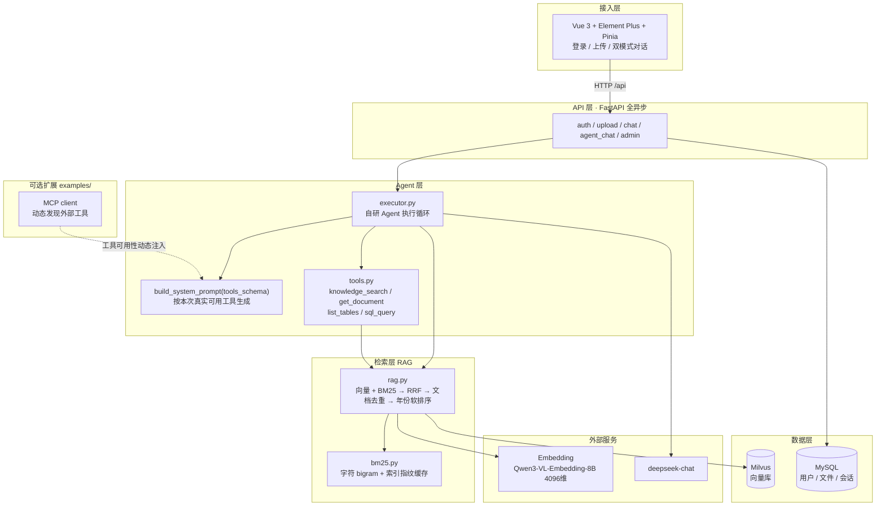

# 企业智能知识库 Agent 平台

> 面向企业知识管理场景的 RAG + Agent 智能问答与数据查询平台。

系统为企业制度文档与结构化业务数据提供统一的自然语言入口：用户直接提问即可完成制度检索、长文档查询与数据统计，Agent 根据任务自主选择并编排可用工具。系统提供两种交互模式：**RAG 模式**（固定执行一次混合检索，答案附 `[n]` 引用）与 **Agent 模式**（由 LLM 自主决定工具与调用轮数，前端实时展示调用轨迹）。

## 核心能力

- **混合检索**：Milvus 向量 + BM25（字符 bigram）多路召回 → RRF 融合 → 文档级去重
  → 年份感知排序；指定来源精查某一份文档时跳过去重并将候选池放大到全量。
- **Agent 工具编排**：自主工具选择与多轮调用、工具并发执行、结果回灌；
  上下文预算与工具输出分档截断（检索 6000 字 / 文档 10000 字，长文档按 `offset` 分页续读）、
  最大迭代轮数与执行超时控制、引文编号整轮唯一。
- **知识库管理**：PDF/TXT 上传、切片向量化、MD5 内容判重（重复返回 409）、引用来源可追溯。
- **结构化数据查询**：Schema 自省 → SELECT-only SQL → 风险关键字拦截 → 自动 LIMIT 与执行超时。
- **工程能力**：FastAPI 全异步后端、Vue 3 + TypeScript 前端、SSE 流式响应、
  JWT（HS256 + pbkdf2）与角色权限、Agent 会话持久化、Docker Compose 部署。
- **评测体系**：104 题检索消融 + 39 题 Agent 评测，结果由脚本生成并持久化为 JSON（见 [Evaluation](#evaluation)）。

## 评测速览

| 指标 | 结果 | 口径 |
|---|---:|---|
| 检索 Recall@8（混合 + 年份策略） | 100.0% | 104 题 · 34 份 gov.cn 公报 |
| 年份 Top-1 命中率 | 100.0% | 14 题年份区分 |
| Agent 任务完成率 | 100.0% | 39 题 |
| 热缓存检索延迟 | 411 ms | 835 chunk / 43.5 万字 |

> 语料为 34 份 gov.cn 公开公报，评测集由脚本生成（104 + 39 题），**不是通用基准**。
> 同一次消融中还包含一组反向结论——融合使 MRR 由 0.925 降至 0.880、向量单路在「主题语义」题上
> 仅 76.9%、BM25 在本语料上反超向量——完整分析与已知偏差见 [Evaluation](#evaluation)。


## 阅读导航

- **部署与运行**：请先阅读 [Quick Start](#quick-start)；接口细节见 [API 接口](#api-接口)；遇到问题请参阅 [常见问题排查](#常见问题排查)。
- **功能与边界**：[核心能力](#核心能力)、[已知限制](#已知限制)。
- **技术设计**：[系统架构](#系统架构) → [核心技术](#核心技术) → [核心设计](#核心设计) → [Evaluation](#evaluation)。
- **工程细节**：[Engineering Notes](#engineering-notes) 记录了开发过程中实际遇到并修复的问题，[项目结构](#项目结构) 为目录说明。
- **后续开发**：[Future Work](#future-work) 按 P0/P1/P2 分级列出了已明确但尚未实施的工作。
- **详细设计文档**：[docs/技术设计文档.md](./docs/技术设计文档.md)（3 万字，逐模块设计、评测口径与设计问答）。


## 演示

两种交互模式共用同一输入框。

**RAG 模式** —— 固定执行一次混合检索，答案附带 `[id]` 引用：

```
用户：2024年国内生产总值是多少？
助手：2024年国内生产总值1349084亿元，比上年增长5.0%。[1]
      来源：[1] 中华人民共和国2024年国民经济和社会发展统计公报
```

**Agent 模式** —— 由 LLM 自主决定调用哪些工具、调用几次，前端实时展示工具调用轨迹：

```
用户：最近上传了几个文件？

  → list_tables   → uploaded_files(id, filename, md5, size, status, created_at)
  → sql_query     → SELECT COUNT(*) FROM uploaded_files WHERE status='done'
  → 完成（2 轮迭代）

助手：当前知识库中共有 2 个文件处于已入库状态。
```


## 系统架构



**单次 Agent 请求的数据流**：

```
用户问题
  → get_all_tools()              取本次真实可用的工具（可能因 MCP 掉线而收缩）
  → build_system_prompt(tools)   按可用工具生成工具清单与强制规则
  → LLM 决策 ──┬─ 返回 tool_calls → 执行工具 → 结果回灌 messages → 回到 LLM 决策
               └─ 返回 content    → 结束，落库，SSE 推给前端
  （最多 6 轮，超限强制收敛）
```


## Quick Start

### 环境要求

Python 3.10+，MySQL 8.x，Node 18+。支持 Windows / Linux / macOS。

### 1. 安装依赖

```bash
pip install -r backend/requirements.txt      # 后端（含可选的 mcp / langgraph）
cd web && npm install                        # 前端
```

### 2. 配置 .env

复制 `backend/.env.example` 为 `backend/.env`，填入自己的 Key 与密码：

```ini
LLM_MODEL=deepseek-chat
LLM_API_KEY=sk-xxx
LLM_BASE_URL=https://api.deepseek.com/v1

EMBEDDING_MODEL=Qwen/Qwen3-VL-Embedding-8B
EMBEDDING_API_KEY=sk-xxx
EMBEDDING_BASE_URL=https://api.siliconflow.cn/v1

MYSQL_HOST=127.0.0.1
MYSQL_PORT=3306
MYSQL_USER=root
MYSQL_PASSWORD=你的mysql密码
MYSQL_DATABASE=rag_agent

# 生产务必改成至少 32 字符的随机串
JWT_SECRET=请改成至少32字符的随机串

# Milvus Lite 本地文件；生产 standalone 用 http://localhost:19530
MILVUS_DB_URI=./milvus.db
```

### 3. 初始化 MySQL

```bash
mysql -u root -p -e "CREATE DATABASE IF NOT EXISTS rag_agent DEFAULT CHARACTER SET utf8mb4;"
```

后端启动时自动建表；版本化迁移使用 `alembic -c alembic.ini upgrade head`（在 `agent/` 根目录执行）。

### 4. 启动

```bash
# 后端 —— 必须在 agent/ 根目录启动，否则 from backend.xxx 导入报错
uvicorn backend.main:app --host 0.0.0.0 --port 8000

# 前端（另开终端）
cd web && npm run dev
```

后端 → http://localhost:8000/docs（Swagger）；前端 → http://localhost:5173（默认账号 `admin` / `admin123`）。
前端通过 Vite 代理将 `/api/*` 转发至 8000，生产环境由 nginx 反向代理。

Docker 一键启动：`docker compose up --build`（自动拉起 MySQL / Milvus standalone / backend / nginx）。

### 5. 灌入语料与运行评测

```bash
python eval/download_docs.py                 # 下载 34 份 gov.cn 公开文档
python eval/build_index.py                   # 建索引

# 评测（需先停掉后端：Milvus Lite 单进程独占 ./milvus.db）
python eval/evaluate_retrieval_ablation.py   # 检索消融
python eval/evaluate_agent.py                # Agent 评测
python eval/render_results.py                # 渲染成 Markdown 表格
```


## API 接口

| 方法 | 路径 | 说明 | 权限 |
|------|------|------|------|
| GET | `/` | 根路由，欢迎信息 | 公开 |
| GET | `/status` | 知识库索引状态 | 公开 |
| POST | `/auth/login` | 登录，返回 JWT | 公开 |
| POST | `/auth/register` | 注册（默认 user 角色） | 公开 |
| POST | `/upload` | 上传 PDF/TXT（MD5 判重） | admin |
| POST | `/chat` | RAG 问答，返回 answer + sources | 登录 |
| POST | `/chat/agent` | Agent 问答，返回 answer + tool_calls + iterations | 登录 |
| POST | `/chat/agent/stream` | Agent 问答（SSE 流式） | 登录 |
| POST | `/admin/reset` | 重置知识库（all / 2h / 12h / 24h） | admin |

```bash
# 登录拿 token
curl -X POST http://127.0.0.1:8000/auth/login -H "Content-Type: application/json" \
  -d '{"username":"admin","password":"admin123"}'

# Agent 问答（自主决定查文档还是查库）
curl -X POST http://127.0.0.1:8000/chat/agent -H "Content-Type: application/json" \
  -H "Authorization: Bearer <token>" -d '{"query":"最近上传了几个文件？"}'
```


## 常见问题排查

### 启动与运行

- **`ModuleNotFoundError: No module named 'backend'`**：后端必须在 `agent/` 根目录启动，`uvicorn backend.main:app` 依赖该工作目录。
- **评测脚本抛出大段 pymilvus 堆栈**：Milvus Lite 单进程独占 `./milvus.db`，后端运行期间评测脚本无法连接。请先停止 `uvicorn` 再运行评测——脚本中的 `_explain()` 会将该异常转换为「请先停掉后端」的提示。
- **端口被占用**：后端默认 8000，前端 5173，两者均需启动。
- **无法登录**：默认账号 `admin` / `admin123`，首次启动时自动预置。

### 检索与回答

- **返回「未找到相关信息」**：先确认该文档已成功入库（`GET /status` 查看 chunk 数），再确认问法是否触发了年份策略（查询含年份时会将候选集放大到全量后软排序）。若需针对某一份具体文档提问，**使用 `source` 指定它比更换关键词更有效**：指定来源时会跳过去重并将候选池放大到全量。
- **同一份文档返回多条片段**：指定 `source` 精查时按设计跳过了文档级去重——此模式下需回答的是「这份文档中哪一段命中了问题」，而非「哪几份文档相关」。
- **来源面板编号与答案中的 `[n]` 不一致**：已知偏差，见 [已知限制](#已知限制) 最后两行。

### 模型与网络

- **LLM / embedding 报 Connection error**：请先检查系统代理残留——代理软件已关闭但系统代理仍启用时，`httpx` 仍会走代理。
- **MCP 工具未出现**：属于预期降级，原因是 `mcp` 包未安装或 demo server 未启动，工具集会自动收缩；`examples/mcp` 下提供了可直接运行的 demo server。
- **报 `Illegal uri`**：环境变量必须命名为 `MILVUS_DB_URI`。写成 `MILVUS_URI` 会被 pymilvus 当作服务端地址解析（该名称为其保留名）。
- **模型答非所问或反复检索**：先检查 `tool_calls` 中的实际调用。Agent 最多 6 轮；连续检索无结果时，提示词要求其如实说明而非继续检索。

### 数据与索引

- **上传返回 409**：MD5 判重命中，说明内容完全相同的文件已在库中。
- **需要清空知识库**：调用 `POST /admin/reset`，支持 `all` / `2h` / `12h` / `24h` 四种范围，仅 admin 可用。


## 隐私与安全

**认证与凭据**

- 密码使用 `pbkdf2_hmac(sha256, 10 万次迭代)` 加 16 字节随机盐哈希，以 `salt$hash` 形式存储，不保存明文。
- JWT 默认使用 HS256、有效期 24 小时，密钥与算法均从配置读取。
- `.env` 已被 `.gitignore` 忽略，且本仓库历史中从未提交过真实 `.env`；`.env.example` 中全部为占位符。
- **部署前必须完成两项修改**：将 `JWT_SECRET` 替换为至少 32 字符的随机串；修改默认账号 `admin/admin123`。

**数据流向（重要）**

- 上传的文档经切片后会送往 **embedding 服务**（默认硅基流动）生成向量；提问时，检索到的片段会随 prompt 送往 **LLM 服务**（默认 DeepSeek）。
- 即：**不应将真实敏感资料导入本知识库**——其内容会离开本机。全流程中不涉及外部请求的环节仅有本地文件解析与切片。

**SQL 与内部信息的边界**

- `sql_query` 仅允许**单条 SELECT**：非 SELECT 语句直接拒绝；`;` 后跟内容判定为多语句并拒绝；关键字黑名单拦截 `INTO / LOAD_FILE / SLEEP / BENCHMARK / INFORMATION_SCHEMA / OUTFILE / DUMPFILE`；无 `LIMIT` 时自动补充并硬限 50 行；执行带 5 秒超时。
- system prompt 中另有一条约束：回答不得出现表名、字段名、SQL 语句、文件路径等内部标识符，一律以业务语言转述（如「目前共 2 份资料」而非「`uploaded_files` 表中有 2 条记录」）。
- **但该约束目前仅为提示词层约束，并非代码强制**，模型仍可能违反。代码级输出脱敏列于 [Future Work](#future-work)。

**权限**

- 上传与重置限 admin 角色；会话记录按用户隔离。


## 核心技术

### 1. 混合检索：RRF 融合而非加权求和

向量检索擅长语义（「贫困人口脱贫」≈「减贫」），BM25 擅长精确串（「2024年」「1349084亿元」）。
两者分数**量纲不可比**（余弦相似度 vs BM25 分数），加权求和需要调一个不稳定的权重。

这里采用 **RRF（Reciprocal Rank Fusion）**，仅依赖排名：`score = Σ 1/(k + rank)`（k=60）。
无需归一化、无需调权，对分数分布的变化天然鲁棒。

融合后进行 **文档级去重**——同一份公报切片成几十个 chunk，不去重会让它占据全部 top-k 名额，
而用户需要的是「哪几份文档相关」，不是「同一份文档的哪几个片段」。

**但指定 `source` 精查某一份文档时结论相反**：该规则会丢弃同文档中真正命中问题的片段
（实测目标 chunk 的 BM25 全量排名为第 0 名，仍无法返回），且候选池按 `top_k` 是在按来源过滤**之前**截断的。
因此此模式下放大候选池并跳过去重——两种意图（「查找相关文档」与「读取这一份文档」）本就应采用不同策略。

### 2. 年份软排序：为什么不做硬过滤

各年份的政府公报正文**高度雷同**（十四五、十五五措辞相近，仅数字不同），
所以查询「2024年GDP」时，正确年份的文档常常排不进默认 top-8。

朴素做法是**硬过滤**：丢弃文件名不含「2024」的全部文档。本项目未采用该做法，原因是：

- 问「十四五规划提出的目标」时，目标年份是 **2025**，而文档名中是 **2021**，
  硬过滤会直接丢弃正确答案；
- 年份是**精确枚举值**，使用字符串匹配即可，不应交由向量相似度「推断」。

最终策略是**软排序**：查询含年份时将候选集放大到全量，融合后将文件名含该年份的文档**排在前面**
（`sort` 而非 `filter`）。排序靠前即可进入 top-k；排序判断失误时仅退化为普通混合检索，**不会造成不可挽回的丢失**。

### 3. Agent 执行循环：自主实现而非框架托管

`backend/agent/executor.py` 是一个 `async generator`，自行维护 `messages` 与迭代计数，
每轮将 `tools` schema 交给 LLM，解析 `tool_calls`、并发执行、把结果回灌后再决策，
同时以 SSE 事件（`status` / `tool_call` / `tool_result` / `answer`）实时推送至前端。

这条循环承载了 Agent 的全部工程细节——截断保护、超时、迭代上限、history 滑动窗口、
工具异常如何回灌给模型、何时丢弃模型的前置思考。执行层自主实现使这些决策全部可见可控，
降低对框架内部执行机制的依赖；交由框架托管则会将其隐藏于黑盒，出现问题时无从定位。
与 LangGraph 的等价对照实现位于 `examples/langgraph_agent/`，完整取舍见
[docs/技术设计文档.md](./docs/技术设计文档.md) 的设计问答。

### 4. 工具可用性反向影响 Agent policy

MCP 工具是**运行时动态发现**的，可能掉线。若 system prompt 写死「必须调用 get_current_time」，
而该工具当前不存在，模型将倾向于发起不存在的工具调用或空转。

为此，prompt 被设计为**工具集的函数**：

```python
tools_schema, tool_map = await get_all_tools()      # 先拿到本次真实可用的工具
messages = _build_messages(query, history, settings, tools_schema)
#                ↓ build_system_prompt 只列出真实存在的工具
#   运行时状态类工具在列 → 追加硬性规则 1.5「必须调工具，禁止凭记忆猜时间」
#   不在列              → 规则 1.5 根本不出现
```

配合两条降级路径：**未安装 `mcp` 包** → `tools.py` 捕获 `ImportError`，仅使用 4 个内置工具；
**server 无法连接** → client 记录错误并返回空工具集（不抛异常）。两条路径均不影响主线问答。

### 5. sql_query 的安全边界

仅允许**单条 SELECT**（正则校验 + 强制 `LIMIT`），执行带 5s 超时。
目的是防止 LLM 生成 `DROP`/`UPDATE` 这类破坏性语句——提示词约束不可靠，必须落到代码校验。


## 核心设计

| 设计决策 | 理由 |
|----------|------|
| **年份软排序而非硬过滤** | 目标年份 ≠ 文档年份（「十四五」目标年 2025，文档名 2021），硬过滤会误伤；软排序错判只退化不丢结果 |
| **有 `tool_calls` 时丢弃前置思考内容** | 模型常边想边说「我来查一下……」，这段文字会先于工具结果到达前端，造成「答案先于证据」的错觉 |
| **评测 collection 与生产 collection 隔离** | `knowledge_chunks_eval` 独立于 `knowledge_chunks`，跑评测不会污染用户上传的索引 |
| **全量语料与 BM25 索引合并成一个缓存条目** | 两者的失效条件完全相同（都只依赖 collection 内容），合并后只需一套指纹，不会出现两套缓存各说各话；指纹用 `count()` 而非全量数据，因为它便宜 20 倍且不需要 load collection |
| **RRF 而非加权分数融合** | 向量分与 BM25 分量纲不可比，归一化和调权都不稳定；RRF 只用排名 |
| **检索模式是可切换的 `mode` 参数** | 消融实验跑的是同一条生产代码路径（只切 mode），保证实验结论与线上行为一致，不是另写一份实验代码 |
| **拒答由 Agent 层负责，不由检索层** | 检索层没有「拒答」语义——误召回率需要相似度阈值才能定义，而阈值不稳定；交给 Agent 判断「检索结果是否足以回答」更可靠 |


## Evaluation

评测代码位于 `eval/`。**评测结果由统一评测脚本生成并持久化为 JSON，再渲染成表格**——
数据集变化后重新运行即可，仓库内不存在手工维护的指标数字。

### 1. 检索策略消融

在 **104 题**评测集上对比 4 种配置（可答 99 题 / 无答案 5 题）：

| 题型 | 题数 | 考察点 |
|------|-----:|--------|
| 数字精确 | 29 | 从长公报中定位具体数值 |
| 政府信息公开 | 18 | 制度类条文检索 |
| 五年规划区分 | 15 | 措辞高度雷同的文档间区分 |
| 年份区分 | 14 | 同主题不同年份 |
| 主题语义 | 13 | 语义改写，无字面重叠 |
| 相似文本 | 10 | 近义表述干扰 |
| 无答案 | 5 | 库外问题（不计入 Recall） |

四种配置：`bm25` / `vector` / `hybrid`（+RRF）/ `hybrid_year`（+年份策略，**生产默认**）。
指标为 Recall@5、Recall@8、MRR@8、年份 Top-1 命中率、平均延迟。

```bash
# 需先停掉后端（Milvus Lite 单进程独占 ./milvus.db）
python eval/build_index.py                    # 建评测索引
python eval/evaluate_retrieval_ablation.py    # 跑消融，写入 retrieval_ablation_result.json
```

结果（数字来自 `eval/retrieval_ablation_result.json`）：

| 检索配置 | Recall@5 | Recall@8 | MRR@8 | 年份 Top-1 | 平均延迟 |
|---|---:|---:|---:|---:|---:|
| BM25 仅关键词 | 99.0% | 99.0% | 0.925 | 92.9% | 992 ms |
| Milvus 仅向量 | 95.0% | 95.0% | 0.851 | 57.1% | 1526 ms |
| + RRF 融合 | 99.0% | **100.0%** | 0.880 | 85.7% | 1487 ms |
| + 年份策略（生产默认） | 98.0% | **100.0%** | 0.876 | **100.0%** | 1745 ms |

各组件贡献（隔离对比，非叠加——`vector` 不是「BM25 + 向量」，它单独一路）：

- **RRF 融合**：单路最佳 Recall@8 99.0% → 融合后 100.0%（+1.0pp）
- **年份策略**：年份 Top-1 85.7% → 100.0%（**+14.3pp**）
- **年份策略的代价**：Recall@5 99.0% → 98.0%（-1.0pp）

分题型 Recall@8：

| 题型 | bm25 | vector | hybrid | hybrid_year |
|---|---:|---:|---:|---:|
| 主题语义 | 100.0% | 76.9% | 100.0% | 100.0% |
| 五年规划区分 | 93.3% | 100.0% | 100.0% | 100.0% |
| 年份区分 | 100.0% | 100.0% | 100.0% | 100.0% |
| 政府信息公开 | 100.0% | 94.4% | 100.0% | 100.0% |
| 数字精确 | 100.0% | 100.0% | 100.0% | 100.0% |
| 相似文本 | 100.0% | 90.0% | 100.0% | 100.0% |

**表格解读**（结论比数字本身更重要）：

1. **在本语料上 BM25 表现最强（99%），向量单路反而更弱。** 语料为政府公报，问句中的
   数字、专有名词在原文中几乎逐字出现，字面匹配的收益被放大。
2. **RRF 融合的价值不在头部指标，而在跨题型稳健性。** 从分题型看：向量在「主题语义」
   （76.9%）与「相似文本」（90.0%）上降幅最大，融合后这两项均回到 100%；
   反之「五年规划区分」为向量 100% / BM25 93.3%，融合同样取到 100%。
   融合的增益来自互补：较弱的一路被拉回，而非提升已达 99% 的头部指标。
3. **融合会拉低 MRR（0.925 → 0.880），这是实际代价。** RRF 仅依据排名而忽略分数，
   会将原本排第一的正确文档往后挤。属于等价交换：以少量排序质量换取跨题型不失手。
4. **年份策略是本次最显著的一处改进**：年份 Top-1 +14.3pp，代价是 Recall@5 -1.0pp
   （候选集放大到全量后，少量非目标年份文档进入了第 5 名之前）。
5. **本评测集偏向字面匹配，这是其已知缺陷。** 题目由 LLM 依据语料原文生成，
   问句与原文共享词汇，对 BM25 系统性有利——「主题语义」是最接近语义改写的题型，
   也仅有 13 题。因此上述数字**不能**用于论证「向量检索没有价值」，
   只能用于论证「在本语料与这批问法下，混合检索是最稳妥的选择」。
   要消除这一偏向，需补充一批零字面重叠的改写题（见 [Future Work](#future-work)）。

### 2. Agent 能力评测

**39 题**，覆盖 6 类任务，评测对象是「Agent 是否执行了正确的动作」，而非仅「答案是否相似」：

| 题型 | 题数 | 考察点 |
|------|-----:|--------|
| 文档问答 | 15 | 是否调 `knowledge_search`、引用是否命中金标准文档 |
| 统计问答 | 7 | 是否调 `sql_query`（并先 `list_tables`） |
| 拒答 | 6 | 库外问题是否如实告知无法查到，而非编造 |
| 结构自省 | 3 | 是否调 `list_tables` 了解表结构 |
| 多工具协作 | 3 | 一题内是否调齐全部预期工具 |
| 工具链 | 3 | 是否按依赖顺序串联（先看结构再写 SQL） |
| 运行时状态 | 2 | 运行时类工具（依赖 MCP） |

指标：任务完成率、工具选择正确率、引用命中率、拒答正确率、LLM 裁判的正确性/忠实性（无幻觉）、平均延迟与迭代轮数。

```bash
python eval/evaluate_agent.py                 # 写入 agent_eval_result.json
```

<!-- ↓↓↓ 粘贴 `python eval/render_results.py` 输出的「Agent 评测」表格 ↓↓↓ -->

## Agent 评测（39 题）

| 指标 | 结果 | 样本数 |
|---|---:|---:|
| 任务完成率 | 100.0% | 39 |
| 工具选择正确率 | 100.0% | 33 |
| 引用命中率 | 100.0% | 18 |
| 拒答正确率 | 100.0% | 6 |
| 正确率（LLM 裁判） | 100.0% | 15 |
| 忠实性/无幻觉（LLM 裁判） | 100.0% | 15 |
| 平均延迟 | 3.8 s/题 | 39 |
| 平均迭代轮数 | 2.4 | 39 |

其中依赖 MCP 的 2 题通过 2 题。

### 分题型

| 题型 | 题数 | 完成率 | 工具选择 |
|---|---:|---:|---:|
| 多工具协作 | 3 | 100.0% | 100.0% |
| 工具链 | 3 | 100.0% | 100.0% |
| 拒答 | 6 | 100.0% | — |
| 文档问答 | 15 | 100.0% | 100.0% |
| 结构自省 | 3 | 100.0% | 100.0% |
| 统计问答 | 7 | 100.0% | 100.0% |
| 运行时状态 | 2 | 100.0% | 100.0% |

<!-- ↑↑↑ 粘贴处 ↑↑↑ -->

裁判参照系的取舍（为何不能提供整篇文档、为何必须复现生产的截断与引文编号）、
统一口径后连跑 8 次的复现记录，以及早期出现的 11/15 与 13/15 两组数字的成因，
均见 [docs/技术设计文档.md](./docs/技术设计文档.md) 第 7.4 节。

### 上下文预算：Agent 所需的资料未能送达

**起因**：评测中唯一稳定失败的一题——问「十二五规划中，化学需氧量和二氧化硫排放量要求分别减少多少」，
答案为 8%，该句位于《十二五规划纲要》工具返回文本的**第 5068 字**处；而 executor 会将单条工具结果统一截断至
`agent_tool_result_max_chars = 4000` 字，Agent 未获得该句内容，因此如实返回「未找到」
（裁判判定正确性 false / 忠实性 true——它没有编造，只是未能答出）。
沿此线索逐项测量后，确认是**三处同源缺陷**，均不在推理侧：

| 缺陷 | 实测证据 | 修法 |
|---|---|---|
| 截断一刀切 | `get_document_fn` 写的是 16000 字预算（`agent_tool_result_max_chars * 4`），但 executor 在它之后又按 4000 截一次，**该预算实际不生效** | 预算按工具分档：`knowledge_search` 6000 / `get_document` 10000 / 其余 4000，集中在 `core/tool_output.py`，可在 `.env` 覆盖 |
| 长文档只返回开头 | 《十二五规划纲要》全文 **58306 字**，截断后模型无法感知尚有四万余字未读取，将「我未读到」等同于「文档中没有」 | `get_document` 支持 `offset` 分页，返回 `total_chars` / `has_more` / `next_offset`，由模型显式续读 |
| 精查某文档反而查不到 | 目标 chunk 的 **BM25 全量排名为第 0 名**，却无法返回：候选池在按来源过滤**之前**即按 `top_k` 截断，且文档级去重（每篇仅保留 1 条）将其丢弃 | 指定 `source` 时把候选池放大到全量、跳过去重，向量侧将过滤下推给 Milvus |
| 引文编号跨调用重复 | `rag.search` 的 `id` 是**本次检索内**的展示序号 1..n，同一次回答调用两次工具即从 1 重新计数，答案中的 `[4]` 无法确定指向哪一篇 | 进入 messages 前由 executor 统一重编号为整轮唯一，`sources` 事件附带 `id` |

**验证**：`eval/repro_context_budget.py` 将当时的一次性测量固化为断言——预算不变量（含 10 条 × 超长文本、
JSON 必须合法、预算利用率不得因丢条而空置）、长文档可达、分页拼接与全文字**逐字相同**、
5 种非法 `offset` 全部被钳制、引文编号整轮唯一且答案仅引用存在的编号，共 53 条全部通过。
**评测结果**：该题从「未找到」变为「化学需氧量和二氧化硫排放量均要求分别减少 8%[8]」，
正确率 14/15 → **15/15**，且裁判理由首次能写出「与资料[8]完全一致」（编号不统一时它无法指向具体资料）。
回归门禁：104 题检索消融的 bm25 / vector / hybrid 三个模式与改动前**逐位相同**
（改动均写成守卫式，不带 `source` 的路径零接触）；延迟基准冷/热一致性未破，
平均延迟 3.8s、迭代 2.4 轮，与改动前持平（两者为 39 题平均值，正常波动 ±0.1）。

### 3. 语料缓存与检索延迟

**优化前先行测量**。将单次 `rag.search()` 分段计时后，发现两笔与查询本身无关的开销：

| 分段（835 chunk / 43.5 万字） | 耗时 | 占比 |
|---|---:|---:|
| `get_all_chunks()` 全量拉回 chunk 正文 | 907.8 ms | 27.8% |
| `BM25Index` 构建（全部 chunk 重新分词） | 281.7 ms | 8.6% |
| `embed_query`（外部 API，不可优化） | 621.4 ms | 19.0% |
| `search_by_vector`（Milvus 真正干活的部分） | 1455.9 ms | 44.5% |
| `ensure_collection` + `count()` | 3.8 ms | 0.1% |

前两项**均只依赖语料内容**，而语料在一次评测或一段服务期内通常不变，却每次检索都重新执行。
两者失效条件完全相同，因此合并为一个「语料缓存」条目，指纹使用 `count()`
（走 `get_collection_stats`，不需要 load collection，仅需 1.8ms）。

实测效果（`python eval/bench_search_latency.py` 可复现）：

| 查询 | 冷（重建） | 热（命中缓存） | 降幅 |
|---|---:|---:|---:|
| 不含年份（绝大多数请求） | 1531 ms | **411 ms** | **3.7x** |
| 含年份（触发全量扫描） | 2956 ms | 1941 ms | 1.5x |

脚本会同时校验**命中缓存前后的检索结果逐条一致**——这是缓存唯一的正确性要求。

> 缓存依靠两道保险失效：① `count()` 指纹变化（增删 chunk 均会改变它）；
> ② 写路径显式失效（`build_index_for_file` / `delete_by_sources` / `clear`）。
> 另叠加 60s TTL，覆盖多 worker 场景下「其他进程写入、本进程无法感知」的盲区。

**同一轮测量还暴露了另一笔开销**：年份策略将候选集放大到全量后，
`search_by_vector` 从 49ms 上升至 1456ms——**年份软排序的代价主要来自向量检索的全量扫描**，
该项尚未优化，已记入 [Future Work](#future-work)。


## Engineering Notes

开发过程中实际遇到并修复的问题，均保留在代码注释中：

- **Milvus Lite 是单进程独占的**。后端 `uvicorn` 运行期间，评测脚本无法打开 `./milvus.db`，
  抛出的是大段 pymilvus 堆栈信息，容易误判为代码缺陷。
  评测脚本因此都带有 `_explain()`，将该异常转换为「请先停掉后端」的提示。
- **环境变量必须命名为 `MILVUS_DB_URI`**。写成 `MILVUS_URI` 会被 pymilvus 当作服务端地址解析并报 `Illegal uri`——该名称是其保留名。
- **MCP 的 stdio 连接内部使用 anyio task group**，`enter`/`exit` 必须在**同一个 asyncio task** 中，
  否则报 `Attempted to exit cancel scope in a different task than it was entered in`。
  而 `get_mcp_tools()` 由各请求协程调用、随请求结束而销毁，不能由其持有连接。
  解决方案是使用一个长驻后台任务独占连接（`_serve`），自身 enter 自身 exit，应用关闭时由 `close_mcp()` 通知退出。
- **`mcp` 不能作为主线的硬依赖**。原先 `tools.py` 直接 `from examples.mcp import mcp_client`，
  未安装 `mcp` 包的环境会导致**所有** Agent 请求失败，而不只是 MCP 相关功能。现已改为捕获 `ImportError` 降级。
- **系统代理残留**会导致 LLM/embedding 报 Connection error（代理软件已关闭但系统代理仍启用）。
- **Windows GBK 控制台**打印 `✓`/`✗` 会触发 `UnicodeEncodeError`，脚本输出一律使用 ASCII。
- **必须在 `agent/` 根目录启动**后端，否则 `from backend.xxx` 导入失败。


## 项目结构

```
agent/
├── backend/                    FastAPI 后端（全异步）
│   ├── main.py                 入口：app 工厂 + CORS + lifespan（建表/预置admin/建collection/释放MCP）
│   ├── core/                   config(Pydantic Settings) / security(JWT) / deps(依赖注入) / tool_output(工具结果预算+引文编号)
│   ├── db/                     base(声明基类) + session(async 引擎)
│   ├── models/                 ORM：User / UploadedFile / ChatHistory / AgentSession / AgentMessage
│   ├── schemas/                Pydantic 请求响应模型
│   ├── repositories/           数据访问层
│   ├── services/               document(切片) / embedding / llm / bm25 / vector_store(Milvus) / rag ★
│   ├── agent/                  tools.py(工具schema) + executor.py(Agent循环) ★
│   ├── tools/                  search_document / query_database
│   ├── api/                    auth / upload / chat / agent_chat / admin
│   └── alembic/                数据库迁移
├── web/                        Vue 3 前端
│   ├── src/api/                axios 封装
│   ├── src/stores/             Pinia（auth / chat）
│   ├── src/views/              LoginView / ChatView
│   └── src/components/         SideBar / MessageItem
├── eval/                       评测：数据集 + 脚本 + 结果 JSON
│   ├── qa_pairs.json           检索评测集（104 题）
│   ├── agent_tasks.json        Agent 评测集（39 题）
│   ├── generate_qa_pairs.py    从真实语料生成题目（带溯源校验）
│   ├── evaluate_retrieval_ablation.py   检索消融 ★
│   ├── evaluate_agent.py       Agent 评测 ★
│   ├── render_results.py       把结果 JSON 渲染成 README 表格
│   └── bench_search_latency.py 检索延迟构成 + 语料缓存基准
├── examples/                   ★ 可选扩展（非主线）：MCP / 多智能体 / LangGraph 对照
│   └── README.md               三个子包的作用、依赖与降级设计
├── docs/                       技术设计文档
├── scripts/                    辅助脚本
│   └── test_backend.py         接口冒烟测试
└── docker-compose.yml          Docker 部署（backend + mysql + milvus + nginx）
```

★ = 值得重点阅读的部分。主线仅为 `rag.py` 与 `executor.py` 两个文件，其余均为其支撑。


## 已知限制

当前版本已完成核心 RAG 检索、Agent 工具编排、认证权限、会话持久化与评测链路。
下列为已知边界与未完成项，列出用于界定当前适用范围。

| 项目 | 当前状态 | 说明 |
|---|---|---|
| 运行平台 | Windows 为主要验证平台 | Linux / macOS 的代码路径未逐项验证；Windows 控制台下需设置 `PYTHONIOENCODING=utf-8`，否则打印 `✓`/`✗` 会触发 `UnicodeEncodeError` |
| 向量库 | 开发使用 Milvus Lite（本地文件 `./milvus.db`） | **单进程独占**：后端运行时评测脚本无法打开同一个库；生产环境切换至 standalone，`docker-compose` 中已配置 |
| 关系库 | MySQL 8.x，必需 | 非可选；启动时自动建表 |
| 外部模型服务 | 需自备 DeepSeek 与硅基流动 API Key | 缺少 Key 时 RAG / Agent 主线不可用（见 [隐私与安全](#隐私与安全)） |
| MCP 工具 | 可选 | 未安装 `mcp` 包或 server 无法连接时自动降级，不影响主线问答 |
| 多智能体 / LangGraph | `examples/` 下的对照实现 | 非主线，不随主线一并演进 |
| 输出脱敏 | 仅提示词层约束 | 代码级强制脱敏尚未实现 |
| 前端来源面板编号 | 已知偏差 | 面板按数组下标显示 `【i+1】`，多次检索时可能与答案中的 `[n]` 不一致（后端已将 `id` 放入 `sources` 事件） |
| 评测集规模 | 104 + 39 题，单一语料 | 语料为 34 份 gov.cn 公报，题目由 LLM 依据原文生成，存在字面匹配偏向（见 [Evaluation](#evaluation) 第 5 条解读） |


## Future Work

按优先级分为三档。每项保留「未实施的原因」——没有前提条件的优化不成立。

### P0 · 已知边界，计划优先处理

- **代码级输出脱敏**：「不得泄露表名/字段名/SQL」目前仅为 system prompt 中的约束，模型仍可能违反。
  方案是在 executor 输出处做一层确定性替换（内部标识符 → 业务名称），并让 `list_tables` 过滤
  `agent_sessions` / `agent_messages` / `users` 这类内部表；需补一批脱敏用例，使「未泄露」成为可测量的指标。
- **前端引用编号与后端 source id 对齐**：面板按数组下标显示 `【i+1】`，未使用事件中的 `id`，
  多次检索时可能与答案中的 `[n]` 不一致。后端已就绪，前端修改两行即可对齐
  （`s.id ?? i+1`，并在 `types.ts` 的 `Source` 上增加 `id?: number`）。

### P1 · 收益明确，需先验证前提

- **年份策略的全量扫描开销**：为让正确年份的文档进入 top-k，候选集被放大到全量，
  `search_by_vector` 由 49ms 上升至 1456ms（已实测，见 [Evaluation](#evaluation) 第 3 节）。
  可行方向是使用 Milvus 的标量过滤（`source like "%2024%"`）先缩小候选集再检索，
  而非将全量拉回后在应用层排序——**前提是验证过滤后的召回率不下降**。
- **零字面重叠的改写题**：现有题目由 LLM 从语料原文生成，天然复用原文用词，对 BM25 这类
  词法检索器系统性有利（「主题语义」题 BM25 达 100%、向量仅 76.9%）。
  需补充零字面重叠的改写题，为向量检索提供公平的评测环境。
- **重排序（Rerank）**：在 RRF 之后接一个 cross-encoder 重排，预期可提升「相似文本」题型的区分度。
  **前提**：它引入一次额外的模型调用，需先有消融数据证明收益大于延迟代价。

### P2 · 架构演进

- **检索阈值拒答**：叠加一层相似度阈值作为双保险。**前提**：先用评测集标定出稳定阈值，
  否则阈值本身就会成为新的误判源。
- **流式 RAG**：`/chat` 目前为整段返回，可复用 `/chat/agent/stream` 的 SSE 通道改为流式输出。
- **多 worker 下的 BM25 缓存**：目前为进程内缓存，多 worker 时每个 worker 各存一份
  （仅影响首次命中，可接受）。如需共享可迁移至 Redis。
- **生产向量库**：Milvus Lite 仅适用于开发环境，生产环境切换至 standalone——`docker-compose` 中已配置。
- **可观测性**：检索与生成链路日志、指标埋点、A/B 评测。

逐项的设计前提与更完整的优化清单见 [docs/技术设计文档.md](./docs/技术设计文档.md)。


## License

[MIT](./LICENSE)
