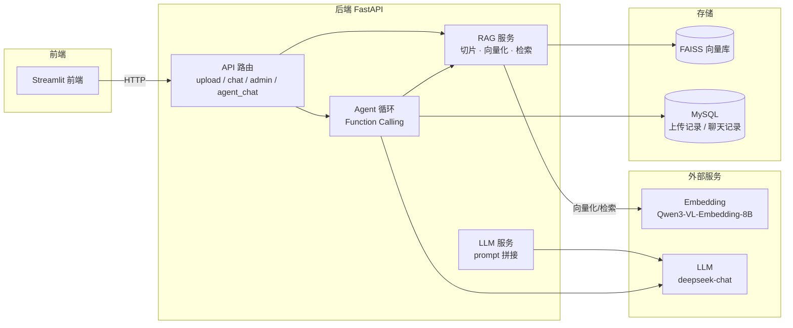

# 企业智能知识库 Agent 平台

基于 RAG + Function Calling Agent 的企业内部知识库智能问答系统。
上传 PDF/TXT 制度文档后，可以用「RAG 模式」做文档检索问答，或用「Agent 模式」
让 LLM 自主决策调用工具——既能检索文档，也能查询结构化数据（SQL），适合
银行/企业制度文档检索 + 统计查询场景。


## 一、功能特性

- 文档上传与去重：上传 PDF/TXT，MD5 判重（重复文件 409 拒绝），自动切片 + 向量化入库
- RAG 问答：向量检索 + LLM 生成，返回答案并附带引用来源与相关度
- Agent 问答：Function Calling 自主决策，动态调用两个工具
    `knowledge_search` —— 检索知识库文档
    `sql_query` —— 查询结构化数据（仅允许 SELECT，白名单表）
- 年份精确过滤：统计公报类文档按年份精确匹配，解决「正文雷同导致年份串味」的问题
- 知识库管理：状态查询、按时间范围重置索引（2h / 12h / 24h / all）
- 用户认证与权限：用户名密码登录，admin/user 两角色；上传/重置限 admin，问答需登录
- Streamlit 前端：登录界面 + 侧边栏（上传/状态/重置）+ 双模式对话界面


## 二、技术栈

| 层 | 技术 |
|----|------|
| 后端 | FastAPI + uvicorn |
| 文档处理 | PyPDF2（文本提取）+ 按句切片（overlap） |
| Embedding | Qwen/Qwen3-VL-Embedding-8B（硅基流动 SiliconFlow） |
| 向量库 | FAISS（IndexFlatIP，内积相似度，单机零配置） |
| LLM | deepseek-chat（DeepSeek API，OpenAI SDK 兼容） |
| Agent | 手写 Function Calling 循环（不依赖 LangChain） |
| 数据库 | MySQL（pymysql + DictCursor） |
| 前端 | Streamlit + httpx |


## 三、项目结构

```
agent/
├── backend/             FastAPI 后端
│   ├── main.py          入口，注册路由 + lifespan 初始化
│   ├── config.py        配置中心（.env 自动加载）
│   ├── api/             upload / chat / admin / agent_chat 路由
│   ├── services/        rag.py（索引/检索/重置）+ llm.py（LLM 调用）
│   ├── agent/           tools.py（工具 schema）+ executor.py（Agent 循环）
│   ├── tools/           knowledge_search / sql_query 工具实现
│   ├── database/        connection（MySQL）+ crud
│   └── models/          Pydantic 请求/响应模型
├── frontend/            Streamlit 前端
│   ├── app.py           主界面（侧边栏 + 聊天区）
│   ├── api_client.py    后端 API 封装
│   └── config.py        后端地址
├── rag_demo/            V0.1 命令行 RAG 核心模块（被 backend 复用）
├── test_backend.py      接口冒烟测试
└── .env.example         环境变量模板（复制为 backend/.env 后填 Key）
```


## 四、快速开始

### 4.1 环境要求

Python 3.10+，MySQL 8.x，支持 Windows / Linux / macOS

### 4.2 安装依赖

    pip install fastapi "uvicorn[standard]" openai faiss-cpu numpy PyPDF2 python-multipart python-dotenv pymysql
    pip install streamlit httpx

Windows 下 faiss-cpu 建议用清华镜像：

    pip install faiss-cpu==1.15.0 -i https://pypi.tuna.tsinghua.edu.cn/simple

### 4.3 配置 .env

复制 `backend/.env.example` 为 `backend/.env`，填入你自己的 Key 和密码（真实值不提交到仓库）：

    LLM_MODEL=deepseek-chat
    LLM_API_KEY=sk-xxx
    LLM_BASE_URL=https://api.deepseek.com/v1

    EMBEDDING_MODEL=Qwen/Qwen3-VL-Embedding-8B
    EMBEDDING_API_KEY=sk-xxx
    EMBEDDING_BASE_URL=https://api.siliconflow.cn/v1

    MYSQL_HOST=127.0.0.1
    MYSQL_PORT=3306
    MYSQL_USER=root
    MYSQL_PASSWORD=你的mysql密码
    MYSQL_DATABASE=rag_agent

### 4.4 初始化 MySQL

启动 MySQL 服务后，创建数据库（后端启动时会自动建表）：

    mysql -u root -p -e "CREATE DATABASE IF NOT EXISTS rag_agent DEFAULT CHARACTER SET utf8mb4;"

### 4.5 启动后端

必须在 agent/ 根目录启动（否则 `from backend.xxx` 导入会报错）：

    uvicorn backend.main:app --host 0.0.0.0 --port 8000

启动后访问 http://localhost:8000/docs 查看 Swagger 文档。

### 4.6 启动前端

另开终端，在 frontend/ 目录下：

    streamlit run app.py

浏览器打开 Streamlit 输出的地址（默认 http://localhost:8501），登录后即可提问。

### 4.7 Docker 一键启动

    docker compose up --build

自动拉起 MySQL 和 backend 两个容器，backend 等 MySQL 就绪后自动建表并预置 admin 账号（默认 admin / admin123）。
访问 http://localhost:8000/docs。


## 五、API 接口

| 方法 | 路径 | 说明 |
|------|------|------|
| GET | / | 根路由，返回欢迎信息 |
| GET | /status | 查询知识库索引状态 |
| POST | /auth/login | 登录，返回 token（无需认证） |
| POST | /auth/register | 注册新用户（默认 user 角色，无需认证） |
| POST | /upload | 上传文档（PDF/TXT，MD5 判重，需 admin） |
| POST | /chat | RAG 问答（返回 answer + sources，需登录） |
| POST | /chat/agent | Agent 问答（返回 answer + tool_calls + iterations，需登录） |
| POST | /admin/reset | 重置知识库（all / 2h / 12h / 24h，需 admin） |


## 六、使用示例

登录（默认账号 admin / admin123，拿 token）：

    curl -X POST http://127.0.0.1:8000/auth/login -H "Content-Type: application/json" -d '{"username": "admin", "password": "admin123"}'

上传文档（需 admin，请求头带 token）：

    curl -F "file=@./data/中华人民共和国2024年国民经济和社会发展统计公报.pdf" -H "Authorization: Bearer <token>" http://127.0.0.1:8000/upload

RAG 问答（需登录）：

    curl -X POST http://127.0.0.1:8000/chat -H "Content-Type: application/json" -H "Authorization: Bearer <token>" -d '{"query": "2024年GDP是多少？"}'

Agent 问答（需登录，自主决定查文档还是查库）：

    curl -X POST http://127.0.0.1:8000/chat/agent -H "Content-Type: application/json" -H "Authorization: Bearer <token>" -d '{"query": "最近上传了几个文件？"}'


## 七、冒烟测试

终端 1 启动后端：

    uvicorn backend.main:app --host 127.0.0.1 --port 8000

终端 2 运行测试（覆盖 5 个接口）：

    python test_backend.py


## 八、架构图




## 九、版本规划

| 版本 | 内容 | 状态 |
|------|------|------|
| V0.1 | 命令行 RAG 最小闭环（切片 → Embedding → FAISS → LLM 问答） | ✅ 已完成 |
| V0.2 | FastAPI 后端（upload / chat / admin / status / MD5 判重） | ✅ 已完成 |
| V0.3 | Agent（Function Calling，knowledge_search + sql_query） | ✅ 已完成 |
| V0.4 | 工程化（前端、引用来源、MySQL、Docker、权限） | ✅ 已完成 |
